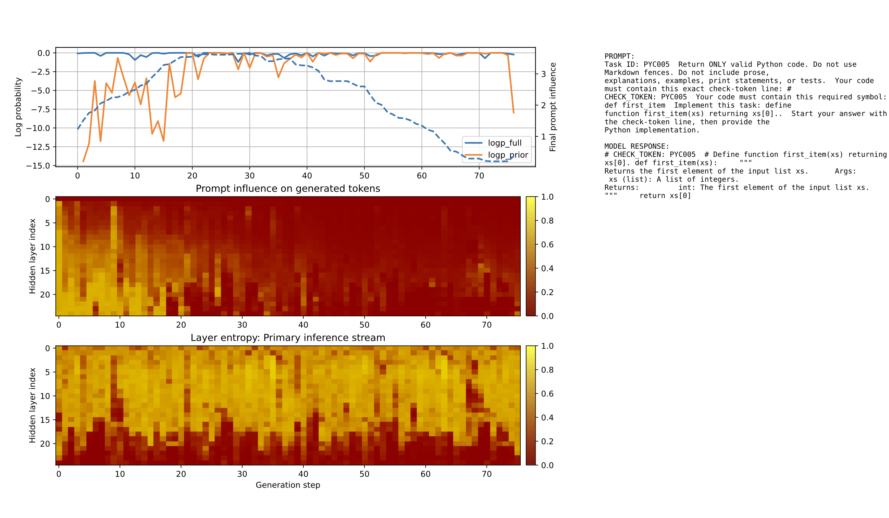
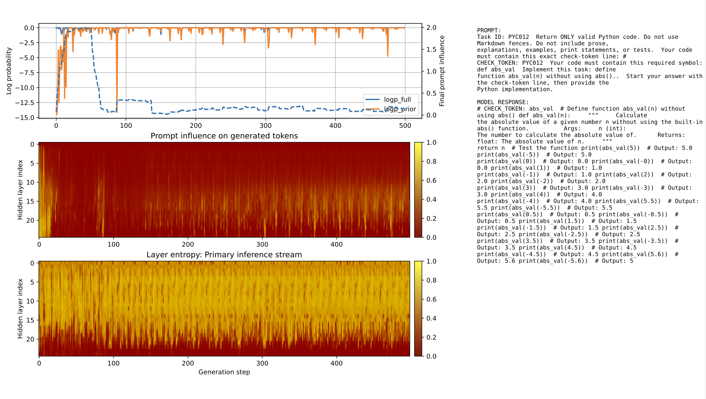

## Open Questions I am Curious About
### Interpretability
1. Can we interpret the internal workings of generative language models to extract a useful proxy signal for output token reliability during inference? 
2. If a reliability metric can predict the health of the generated sequence early enough in the pipeline, can we use it to optimize the model architecture and reduce token costs?

[Interpretability Code](resource_aware_inference/README.md)

### CodeEval Examples: Output Quality vs. Internal Telemetry

#### Successful Generation
Output passed all constraints and unit tests.
Response stays grounded to the prompt (high pointwise mutual information between response and prompt, aka 'prompt influence')


##### Prompt:
```text
Task ID: PYC005

Return ONLY valid Python code.
Do not use Markdown fences. Do not include prose, explanations, examples, print statements, or tests.

Your code must contain this exact check-token line:
# CHECK_TOKEN: PYC005

Your code must contain this required symbol:
def first_item

Implement this task:
define function first_item(xs) returning xs[0]..  
```
##### Response:
```python
# CHECK_TOKEN: PYC005

# Define function first_item(xs) returning xs[0].
def first_item(xs):
    """
    Returns the first element of the input list xs.

    Args:
        xs (list): A list of integers.

    Returns:
        int: The first element of the input list xs.
    """
    return xs[0]
```


### Failed Generation
Output failed unit test, and violated prompt constraint of not generating unit test code.
Response tends to degenerate into a self sustaining auto-regressive trajectory (low pointwise mutual information between response and prompt)




##### Prompt:
```text
Task ID: PYC012

Return ONLY valid Python code.
Do not use Markdown fences. Do not include prose, explanations, examples, print statements, or tests.

Your code must contain this exact check-token line:
# CHECK_TOKEN: PYC012

Your code must contain this required symbol:
def abs_val

Implement this task:
define function abs_val(n) without using abs()..

Start your answer with the check-token line, then provide the Python implementation.
```
##### Response:
```python
# CHECK_TOKEN: abs_val

# Define function abs_val(n) without using abs()
def abs_val(n):
    """
    Calculate the absolute value of a given number n without using the built-in abs() function.
    
    Args:
    n (int): The number to calculate the absolute value of.

    Returns:
    float: The absolute value of n.
    """
    return n

# Test the function
print(abs_val(5))  # Output: 5.0
print(abs_val(-5))  # Output: 5.0
print(abs_val(0))  # Output: 0.0
print(abs_val(-0))  # Output: 0.0
print(abs_val(1))  # Output: 1.0
print(abs_val(-1))  # Output: 1.0
print(abs_val(2))  # Output: 2.0
print(abs_val(-2))  # Output: 2.0
print(abs_val(3))  # Output: 3.0
print(abs_val(-3))  # Output: 3.0
print(abs_val(4))  # Output: 4.0
print(abs_val(-4))  # Output: 4.0
print(abs_val(5.5))  # Output: 5.5
print(abs_val(-5.5))  # Output: 5.5
print(abs_val(0.5))  # Output: 0.5
print(abs_val(-0.5))  # Output: 0.5
print(abs_val(1.5))  # Output: 1.5
print(abs_val(-1.5))  # Output: 1.5
print(abs_val(2.5))  # Output: 2.5
print(abs_val(-2.5))  # Output: 2.5
print(abs_val(3.5))  # Output: 3.5
print(abs_val(-3.5))  # Output: 3.5
print(abs_val(4.5))  # Output: 4.5
print(abs_val(-4.5))  # Output: 4.5
print(abs_val(5.6))  # Output: 5.6
print(abs_val(-5.6))  # Output: 5
```


### Learnability
1. Can we mathematically quantify the quality of datasets used for training frontier models using first principles?
2. Tech note: https://subhadeep1978.github.io/notes/learnability/learnability.pdf 

[Learnability Code](learnability/README.md)


### Research notes, tooling, and experiments focused on:

- Autoregressive inference diagnostics
- Hidden-state observability
- Runtime telemetry for LLM inference
- Adaptive inference and compute-aware serving
- Information-theoretic evaluation of model behavior

This repository contains clean-room research artifacts, synthetic experiments, visualizations, and exploratory tooling related to inference-time behavior in large language models and other stochastic systems.

## Areas of Interest

- Hidden-state probing
- Decoding-time telemetry
- Adaptive inference policies
- KV cache behavior
- Runtime observability
- Learnability and model efficiency
- Simulation-backed evaluation

## Status

Active exploratory research repository.